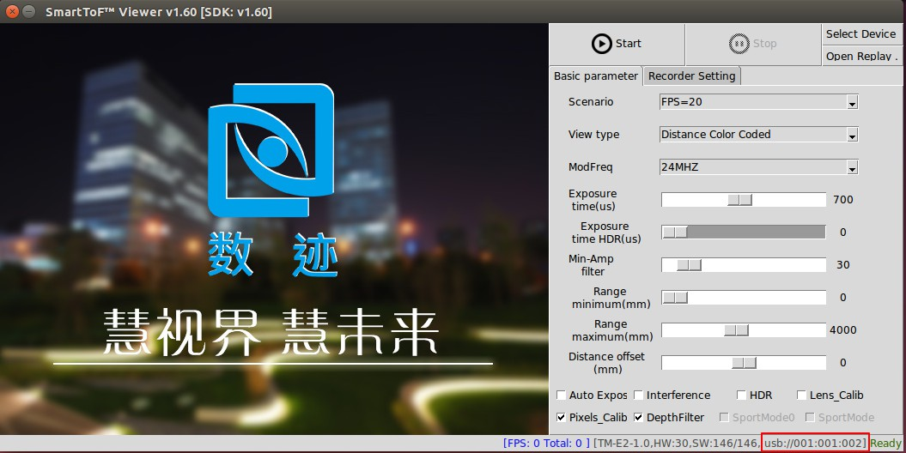

平台安装
=============

windows下安装
+++++++++++++++++++

在windows下连接使用模组时，需要安装模组的usb驱动，模组的一般安装流程如下：

推荐系统配置
---------------------

+---------+------------------------------------------+
|配置项   |  推荐配置                                |
+=========+==========================================+
|操作系统 |  Windows: Win7 32/64位 Win10 32/64位     |
|         +------------------------------------------+
|         |  Linux: Ubuntu14.04 64位 Ubuntu16.04 64位|
+---------+------------------------------------------+
|内存     |  4G及以上                                |
+---------+------------------------------------------+	

模组准备
--------------------

模组套件包括TC系列模组、MicroUSB线和电源（部分型号无需电源）如表2所示

.. list-table:: 表2 模组套件
	:widths: 30 40 60
	:header-rows: 0
	:stub-columns: 0
	
	* - 1
	  - TC系列模组
	  - .. image:: imageG/win_G1.jpg
			:width: 100
	* - 2
	  - Micro USB电缆
	  - .. image:: imageG/win_G2.jpg
			:width: 100
	* - 3
	  - 12V 电源
	  - .. image:: imageG/win_G3.jpg
			:width: 100
			
模组安装
--------------------

在windows系统下，运行SDK中windows/drivers目录下的smarttof_usb_install.exe程序进行驱动的安装，正常安装过程如下图所示

.. image:: imageG/win_G4.jpg

驱动正常安装后，将USB电缆连接模组和PC,打开设备管理器中可以看到模组的设备名，如下图所示

.. image:: imageG/win_G5.jpg

linux下安装
+++++++++++++++++++

libusb的安装
-----------------------

在使用Linux的发行版ubuntu14和ubuntu16时，默认自带libusb，无需安装usb驱动，如果需要重装libusb,
删除原来的libusb后，在终端中重新输入命令进行安装::

  sudo apt-get install libusb-1.0-0-dev

然后运行SDK目录边tool/SmartTofViewer目录下的smartTOFViewer工具查看设备是否连接正常，正常连接如下图
所示显示设备号

libusb权限修改
-----------------------

为了便于每次使用模组时，不用重复输入密码，需要给usb增加相应的规则，SDK中已经提供规则设置脚本，
只要运行在linux/lib目录下的setup.sh脚本，运行脚本过程如下图

.. image:: imageG/win_G7.jpg

