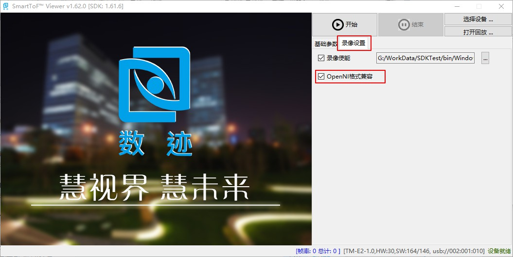

工具初步使用
==================

SDK配套SmartToFViewer显示评估工具和dmcam-cli命令行工具，分别在SDK中的tools目录下，
SmartToFViewer同时提供smartTOF_PCLViewer点云显示工具。

SmartToFViewer使用
+++++++++++++++++++++

SmartToFViewer可以直接用来评估被测物体图像，并通过UI设置模组相关参数，
查看模组的相关信息和工作状态，SmartToFViewer在模组usb正常安装时即可使用。

SmartToFViewer界面介绍
-----------------------

SmartToFViewer打开后的整体预览如下，SmartToFViewer主要包括图像显示区、
基础参数区、filter设置区、信息区以及模组的开启关闭：

.. image:: imageG/win_V1.jpg

SmartToFViewer采集显示
------------------------

双击运行SmartToFViewer工具，点击选择设备，如果同时连接多台模组，会列出设备列表，
左击选择要使用的设备后点击图中的OK按钮，如下图：

.. image:: imageG/win_V6.jpg

选取设备后点击 ``开始`` 按钮就可以采集图像显示了，默认视图模型为深度图-彩色编码，如下图
所示，图中显示了物体的深度距离信息。
拖动或者点击界面上的相关按钮，可以对模组的采集参数设置和滤波功能使能，具体参考详细
说明中的SmartToFViewer的详细说明。

.. _doc-Replay:

SmartToFViewer录像功能
------------------------
SmartToFViewer支持录像功能，录制的视频文件可以作为离线算法评估的图像数据。Viewer打开
后选择好设备后，点击图中的 ``录像设置`` 选项卡，并勾选 ``录像使能``，选择录像文件的保存
地址，如下图：

.. caution::

  在 ``录像设置`` 选项卡下还有个 ``OpenNI格式兼容`` 选项，该选项功能说明如下

  - 使能模式下，如果用NiViewer播放录像文件时，输出深度图和灰度图
  
  - 不使能模式下，用NiViewer播放录像文件时，输出4DCS(tof芯片的raw数据)的原始图像。

点击SmartToFViewer上的 ``结束`` 则停止录像，并将oni格式的录像文件保存到刚才选择的地址。

SmartToFViewer播放录像文件
----------------------------

打开SmartToFViewer，点击 ``打开回放`` 按钮，选择保存的录像文件，选中后SmartToFViewer右
下角的USB设备号变成录像的文件名，如下图所示

.. image:: imageG/win_V8.jpg

如果要开启点云图，则需要同时开启SmartToFViewer和SmartToF_PCLViewer：如下图

.. image:: imageG/win_V5.jpg

dmcam-cli命令行工具使用
+++++++++++++++++++++++++

SDK中的dmcam-cli工具是方便用户在二次开发时进行诊断和测试使用，主要包括以下几个功能：

* 硬件设备信息获取
* 硬件参数设置
* 数据采集和保存
* 固件更新

dmcam-cli基本信息获取
------------------------------

dmcam-cli通常通过命令行参数方式、脚本文件方式、交互模式与硬件设备进行交互，如下图展示了命令行
参数模式和交互模式获取设备信息：

.. image:: imageG/win_V9.jpg

dmcam-cli的其他具体功能介绍请参考 :ref:`sec-reference` 中SDK工具详细说明。

