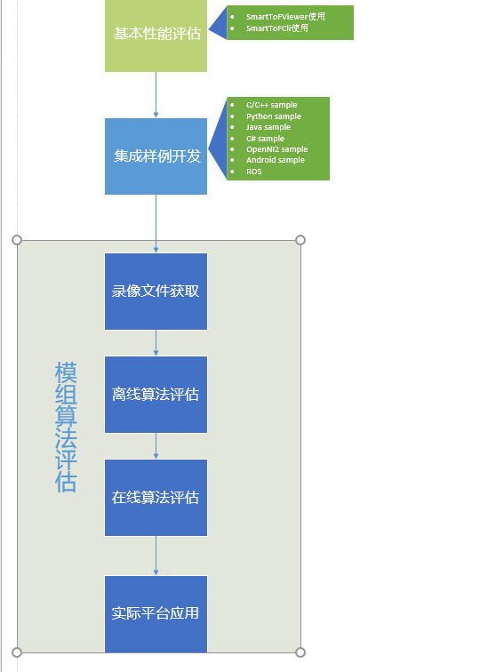

.. _doc-GRIP:

基本开发流程
=================

开发流程框图
+++++++++++++++++

在对Smartof模组进行二次开发时，一般的开发流程图如下

开发流程说明
+++++++++++++++++

模组基本性能评估
------------------

在获得SmartToF模组后，使用SDK中tools目录下提供的SmartToFViewer工具进行被测物体的实时显示。显示时根据被测
物体的远近、运动状态等调节SmartToFViewer上的相关参数，通过显示效果评估模组的成像质量、深度距离的精确度等信息。
如果要评估模组的点云效果，需要在开启SmartToFViewer的同时开启SmartToF_PCLViewer。

模组样例集成开发
-----------------

通过使用SmartToFViewer进行模组的评估，能够基本了解模组的一些参数和滤波功能，后续可以按照 :ref:`sec-tutorial` 的说明
熟悉和运行SDK中提供的样例。掌握自己所要使用的开发平台和语言环境下使用SDK的主要步骤，参考样例代码，代码中相关的API详细
说明参考 :ref:`sec-reference` 中的对应章节，编写集成自己的测试样例进行模组数据的采集和显示。

* C/C++的用户参考 :ref:`C/C++<tutorialc>` 的相关样例和编译运行C/C++样例的方法。
* Python用户参考 :ref:`Python<tutorialpython>` 的相关样例和运行样例方法。
* Java用户参考 :ref:`Java<tutorialjava>` 的basic和basicUI样例以及运行样例的方法。
* C#用户参考 :ref:`C#<tutorialcsharp>` 的basic和basicUI样例以及运行样例的方法。

模组算法评估开发
-------------------

为了方便快捷的使用smarttof模组进行算法开发，SmartToF SDK提供了一套完整的开发流程说明，将整个开发流程分为录像文件获取、
离线算法评估、在线算法评估、实际平台应用等四个阶段，每一阶段的具体说明如下。

录像文件获取
^^^^^^^^^^^^^^^^

算法评估的基础是建立在完整准确的数据之上，针对前期没有模组进行数据采集或者不确定采集的图像数据是否正确的情况下，
可以先期通过smarttofviewer的录像功能进行获取，也可以通过dmcam-cli工具的rx命令采集。如何使用Smarttofviewer的录像功能录制录像文件
和使用dmcam-cli工具的rx命令采集保存文件参考 :ref:`sec-reference` 中的工具说明。

离线算法评估
^^^^^^^^^^^^^^^

在获得的录像文件上加载运行评估算法，对比算法加入后运行的实际效果，如要对原始深度数据进行滤波，可以加入常用的中值或者双边滤波，
也可以是改进后的深度滤波，通过滤波前后的图像效果评估算法效果。这种离线算法评估解决了部分用户在没有模组或者未能正常采集模
组数据的情况下，能够正常进行算法评估开发的相关工作。

在线算法评估
^^^^^^^^^^^^^^^
经过前期在离线录像文件上的算法评估，基本确定被评估算法的效果，判断评估算法是否达到设计要求，后续就是在模组上进行
动态的实际效果的算法评估。在采集SmartToF模组实时数据的同时加入前面离线评估的算法处理，实时观察和评测算法在pc上的
实际效果，最终确定在SmartToF上使用的算法是否达到使用要求。

实际平台应用
^^^^^^^^^^^^^^^
前期的离线算法评估和在线算法评估主要是基于PC平台，在实际应用中，SmartToF模组可能需要被运行在各种不同的嵌入式平台。
这时需要在对应的平台上运行相应的SmartToF的库，同时将前面的评估算法移植到对应的平台，并根据平台对算法进行相应的
优化，最后在实际的嵌入式平台上进行应用的开发。