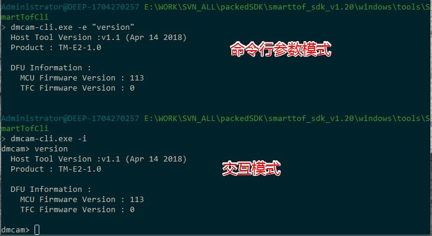

dmcam-cli工具详细说明
++++++++++++++++++++++++

dmcam-cli工具概述
==================

SDK中的dmcam-cli工具是方便用户在二次开发时进行诊断和测试使用，主要包括以下几个功能：

* 查看可用设备列表
* 硬件设备信息获取
* 目标寄存器配置
* 常用参数读取及设置
* 不同类型图像数据采集和保存
* 设备复位
* 设备固件更新

dmcam-cli工作方式
===================

dmcam-cli可以通过命令行与硬件设备进行交互，一般通过下面三种方式使用：

* 命令行参数方式：具体参数定义参见表2-1
* 脚本文件方式: 参见表 2 1 中‘-s, --script <file>’选项。
* 交互模式：参见表 2 1 中’-i, --interactive’选项，默认启动进入交互模式。

下图是命令行参数模式和交互模式的参考使用截图

.. tip::
    在windows下，直接双击运行dmcam-cli.exe,默认进入交互模式。
	
dmcam-cli详细命令
====================

下表2-1列出了dmcam所有的命令和参数，并展示了样例的基本使用方法。更详细的说明可输入--help和--help-interactive参数进行查看。

.. list-table:: 表2-1 命令列表
	:widths: auto
	:header-rows: 1
	
	* - Script mode functions
	  - options
	  - appended options
	  - example
	* - 指定设备
	  - ``-d, --device <device>``
	  - 
	  - ``dmcam-cli.exe --print info --device 0``
	* - set verbosity
	  - ``-v, --verbosity <level>``
	  - 
	  - ``dmcam-cli.exe --print info --device 0 -v critical``
	* - 枚举设备
	  - ``-l, --list``
	  - 
	  - ``dmcam-cli.exe -l``
	* - 复位设备
	  - ``-r, --reset``
	  - 
	  - ``dmcam-cli.exe -r``
	* - 执行 interactive mode command, 可多次使用
	  - ``-e, --exec <command>``
	  - 
	  - ``dmcam-cli.exe -e "print info" -e "print frame_format"``
	* - Run provided script
	  - ``-s, --script <file>``
	  - 
	  - ``dmcam-cli.exe -s script.txt``	  
	* - 进入 interactive mode
	  - ``-i, --interactive``
	  - 
	  - ``dmcam-cli.exe -i``	 	  
	* - print cli version
	  - ``--version``
	  - 
	  - ``dmcam-cli.exe --version``
	* - print cli help info
	  - ``-h, --help``
	  - 
	  - ``dmcam-cli.exe --help``	  
	* - show interactive mode help info
	  - ``--help-interactive``
	  - 
	  - ``dmcam-cli.exe --help-interactive``	  
	* - 固件升级
	  - ``-f, --flash-MCU-firmware <file>``
	  - 
	  - ``dmcam-cli.exe --flash-MCU fw_mcu.bin``	  
	* - 写寄存器
	  - ``--regwr``
	  - ``--target <target> --base <base> --value <val>``
	  - ``dmcam-cli.exe --regwr --target tfc_tg --base 0x100 --value 0xaa`` ``dmcam-cli.exe --regwr --target tfc_tg --base 0x100 --value "0xaa 0xbb 0xcc"`` ``dmcam-cli.exe --regwr --target tfc_tg --base 0x100 --value test.bin``
	* - 读寄存器
	  - ``--regrd``
	  - ``--target <target> --base <base>``
	  - ``dmcam-cli.exe --regrd --target tfc_tg --base 0x100`` ``dmcam-cli.exe --regrd --target tfc_tg --base 0x100 --cnt 5`` ``dmcam-cli.exe --regrd --target tfc_tg --base 0x100 --cnt 5 --value test1.bin``
	* - 写参数
	  - ``--set <param>``
	  - ``[--param <param>] --value <val>``
	  - ``dmcam-cli.exe --set mode --value 1``
	* - 读参数
	  - ``--print <param>``
	  - ``[--param <param>]``
	  - ``dmcam-cli.exe --print mode``
	* - 
	  - 
	  - 
	  - 
	* - **以下为交互模式**
	  - 
	  - 
	  - 
	* - 查看命令帮助信息
	  - ``help <cmd>``
	  -
	  - ``help rx``
	* - 设备列表
	  - ``list``
	  -
	  - 	  
	* - 固件升级
	  - ``flash <target> <version>``
	  -
	  - ``flash mcu fw_mcu.bin``
	* - 写寄存器
	  - ``regwr <target> <base> [<&file> | <P0> <P1>… <P4n>]``
	  - 
	  - ``regwr mcu 0x11 test.bin`` ``regwr tfc_de 0x10 0x11 0x12 13``
	* - 读寄存器
	  - ``regrd <parameter> <base> [cnt] [&file]``
	  - 
	  - ``regrd mcu 0x01 5 regrd tfc_de 0x10 test2.bin``
	* - 写参数
	  - ``set <parameter> <arguments>``
	  - 
	  - ``set frequency 1 set frame_format 1 set frame_rate 30 set intg_time 30``
	* - 读参数
	  - ``print/p [parameter]``
	  - 
	  - ``print`` ``print info`` ``print mode`` ``print frequency`` ``print format`` ``print frame_rate`` ``print roi``
	* - 采集固定数量的frame到文件
	  - ``rx <data src> <&file> <frame count>``
	  - 
	  - ``rx raw raw.bin 10`` ``rx depth depth.bin 10``
	* - 采集固定数量数据到buffer
	  - ``read <frame count>``
	  - 
	  - ``read 5``
	* - 同print info
	  - ``info``
	  - 
	  - ``info``
	* - 显示所有version信息
	  - ``version``
	  - 
	  - ``version``
	* - 采集指定时间距离数据
	  - ``capture <option> <args>``
	  - 
	  - ``capture -c start``
	* - filter参数配置
	  - ``filter <id> <enabled> [args]``
	  - 
	  - ``filter <ID_AMP> 1 40``
	* - 复位命令
	  - ``reset <target>``
	  - 
	  - ``reset sys``
	* - others
	  - 
	  - 
	  - ``cls`` ``quit`` ``help`` ``h rx`` ``echo who am i``

.. caution::
    针对TC系列模组,谨慎涉及寄存器的读写操作，误读写可能产生不可预知的问题。
	
查看可用设备信列表
-------------------

当设备连接后，可以通过dmcam-cli -d命令查看可用设备列表，命令如下::

	dmcam-cli -l

输出结果如下::

	4 dmcam device found
	[0]: Type=USB  BUS:PORT:ADDR=07:04:03
	[1]: Type=USB  BUS:PORT:ADDR=07:03:04
	[2]: Type=ETH IP=192.168.1.38 CID=0xfbf056c1
	[3]: Type=ETH IP=192.168.1.53 CID=0xf2a4fa3e
	
硬件设备信息获取
-------------------

当设备连接后，可以通过dmcam-cli交互模式的print命令进行硬件设备信息获取，命令格式如下::

	p [parameter]
	
.. image:: clifigure/2设备信息.jpg

常用参数设置
-------------------

当设备连接后，可以通过dmcam-cli交互模式的set命令设置硬件参数，命令格式如下::

	set <parameter> <arguments>

可以通过下面命令查看set命令有哪些参数可以设置及参数含义，命令如下，结果见下图::

	help set
	
.. image:: clifigure/param_set.jpg

不同类型图像数据采集和保存
-----------------------------------

当设备连接后，可以通过dmcam-cli交互模式的rx命令进行数据采集，并将数据存入指定文件，采集的数据格式包括原始数据、深度数据、灰度数据和点云数据，命令格式如下::

	rx  <data src> <&file> <frame count>
	
.. image:: clifigure/4交互数据采集.jpg

设备复位
-------------------

当设备连接后，可以通过dmcam-cli交互模式的reset命令复位设备，命令格式如下::

	reset <target>

测试结果如下图
	
.. image:: clifigure/reset.jpg

固件更新
-------------------

固件更新的详细内容参考 :ref:`SDK固件升级 <update-label>`

	  
	  