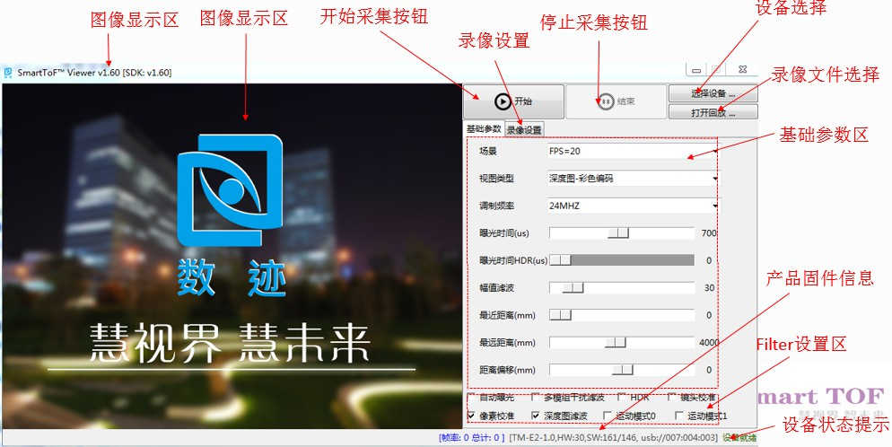
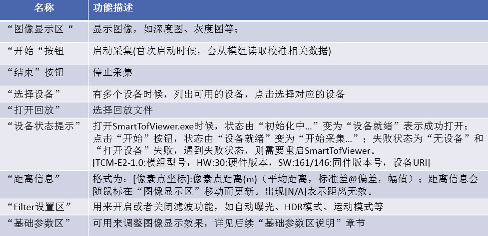
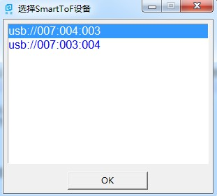
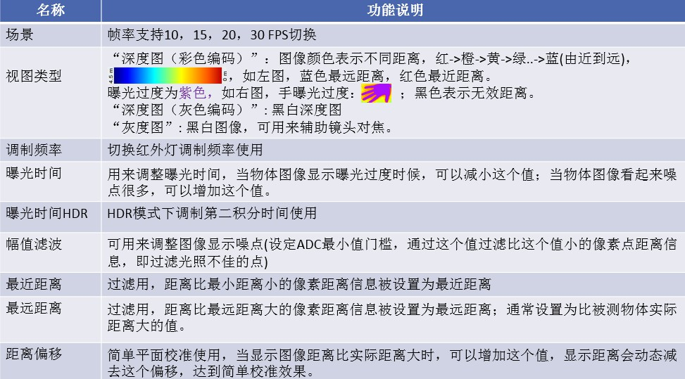
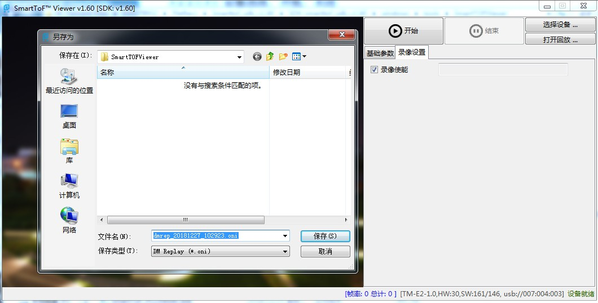
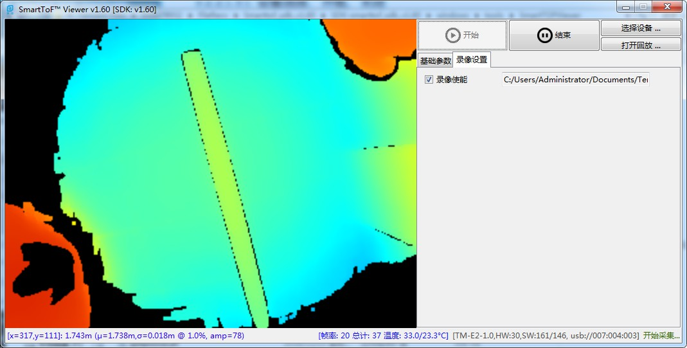
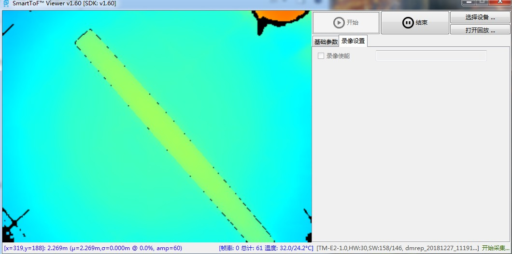

SmartToFViewer使用说明
+++++++++++++++++++++++

简介
=======================

| SmartToFViewer是一款可视化工具，可以用来快速评估模组效果，熟悉不同参数对显示效果影响，并确定最佳参数辅助实际开发使用。
| 主要支持功能如下:

 * 设备选择、打开、关闭等
 * 显示图像深度图、灰度图等
 * 配合PCLViewer显示点云图
 * 查看物体和模组摄像头间距离
 * 查看模组信息及工作状态
 * 设置常用参数
 * 设置滤波特性
 * 设置运动模式
 * 录像及回放录像
 
界面介绍
=======================

SmartToFViewer打开后的整体预览如下，SmartToFViewer界面主要包括图像显示区、基础参数区、录像设置区、filter设置区、信息区以及模组的开启关闭：

SmartToFViewer功能区说明如下图：

详细使用说明
============================

设备选择、开始、结束
-----------------------------------------

选择设备（适用于多个设备接入情形，打开GUI时候，会提示选择，如果只接入一个设备，可以直接点击”开始“），点击“选择设备”按钮，如下图

| 点击“开始“后，图像区显示采集图像，默认开启为深度图模式，在图像显示区下面显示深度信息，结束采集点击”结束“按钮。

.. image:: viewerfig/深度图2.jpg

图像显示切换
-----------------------------------------

通过基础参数区修改视图类型，可以选择查看灰度图、深度图等四种模式，如灰度图

.. image:: viewerfig/灰度图3.jpg

PCLViewer显示点云图
-----------------------------------------

如果要开启点云图，则需要同时开启SmartToFViewer和SmartToF_PCLViewer：如下图

.. image:: viewerfig/点云图4.jpg

查看模组信息及工作状态
-----------------------------------------

模组信息及工作状态可以参考下图

.. image:: viewerfig/info.jpg

基础参数说明
-----------------------------------------

通过Smartviewer可以直观的调节帧率、曝光时间、幅值滤波等，基础参数区的详细说明如下图

如曝光时间一般在物体不过曝的情况下尽量调大，但不能过曝，过曝部分会呈现紫色如下图：

.. image:: viewerfig/过曝光.jpg

filter功能说明
-----------------------------------------

SmartTofViewer的filter功能区主要开启模组相关的滤波功能，滤波功能的具体描述如下图：

.. image:: viewerfig/Filter功能区说明.jpg

运动模式
-----------------------------------------

对于运动速度比较快物体，正常模式图像会有类似拖影、重叠的运动模糊现象，可以勾选“运动模式0”或者“运动模式1”
使能运动模式，减小运动模糊现象，如下图

.. image:: viewerfig/mbr.jpg

录像与回放
-----------------------------------------

运行启动SmartTofViewer，切换到“录像设置”菜单，勾选“录像使能”，弹出保存文件名字及目录对话框，保存录像文件，如下图

点击开始，此时采集的图像将会保存到本地文件，运行如下图，点击“结束”按钮，停止录像

播放录像文件，点击“打开回放”，选择刚录制的文件，如下图

.. image:: viewerfig/录像设置3.jpg

点击“开始”，运行效果如下图

.. caution::
    录像文件下，“调制频率” 、“运动模式0”、 “运动模式1”、“HDR”、“曝光时间”设置调整无效

